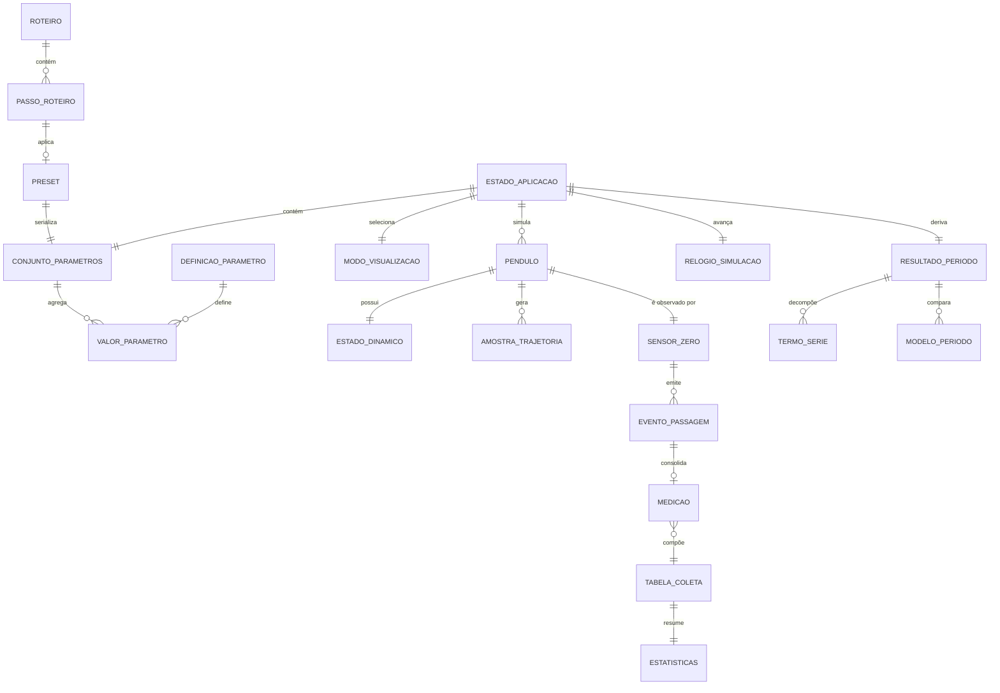
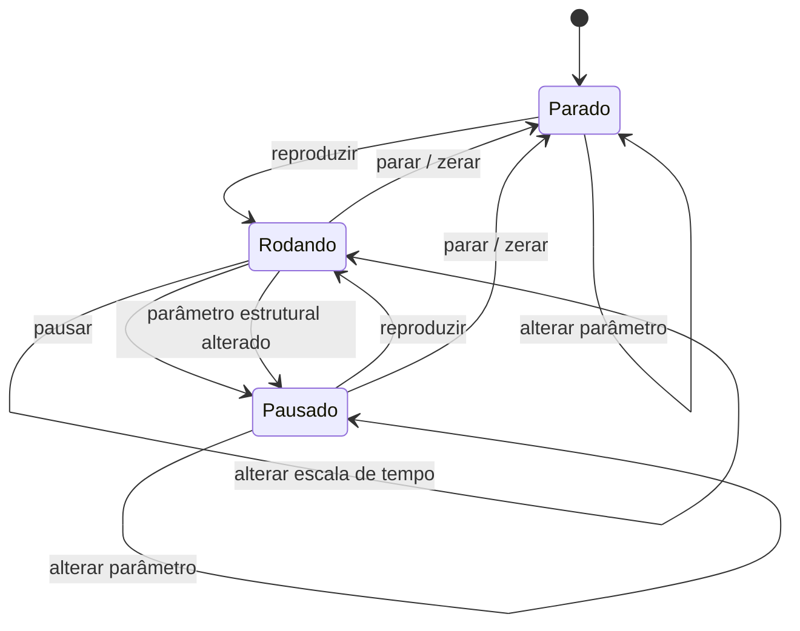

# Modelo de Dados: Pêndulo — Fórmula Completa

**Funcionalidade**: `001-pendulo-formula-completa`
**Data**: 2026-08-17
**Origem**: [spec.md](./spec.md) (entidades-chave e catálogo de parâmetros) · [plan.md](./plan.md) (camadas)

Todas as grandezas são armazenadas **internamente no SI e em radianos**. A conversão para a unidade
de exibição ocorre exclusivamente na borda da interface. Tipos nominais em `physics/units.ts`
impedem a mistura acidental de radiano com grau e de metro com pixel.

---

## 1. Visão Geral das Entidades



---

## 2. Entidades do Catálogo de Parâmetros

### 2.1 `DefinicaoParametro` — a fonte única de verdade

Declarada **uma única vez** em `src/state/schema.ts`. Dela derivam: os controles da interface, o
console de texto, a validação, o endereço compartilhável, os presets e a documentação. Nenhum
controle pode ser escrito à mão fora deste esquema (Princípio III).

| Campo | Tipo | Obrigatório | Descrição |
|---|---|---|---|
| `id` | `string` | sim | Identificador estável, usado na URL e no CSV. Ex.: `alpha`, `L`, `g` |
| `codigo` | `string` | sim | Código do catálogo da spec. Ex.: `P02` |
| `simbolo` | `string` | sim | Símbolo exibido. Ex.: `α` |
| `chaveI18n` | `string` | sim | Chave do nome e da descrição nos dicionários |
| `tipo` | `'numero' \| 'booleano' \| 'enum' \| 'multipla' \| 'cor' \| 'acao' \| 'texto'` | sim | Determina o controle gerado |
| `unidadeInterna` | `Unidade \| null` | sim | Unidade de armazenamento. Ex.: `rad`, `m`, `kg`, `s` |
| `unidadeExibicao` | `Unidade \| null` | sim | Unidade padrão de exibição. Ex.: `deg` |
| `min`, `max` | `number` | se numérico | Limites **inclusivos** em unidade de exibição |
| `passo` | `number` | se numérico | Incremento do slider e das setas |
| `passoFino` | `number` | não | Incremento com modificador de precisão |
| `padrao` | `unknown` | sim | Valor de fábrica; alvo do botão de restaurar |
| `precisao` | `number` | se numérico | Casas decimais para exibição e serialização |
| `grupo` | `GrupoParametro` | sim | `geometria \| cicloide \| ambiente \| modelo \| visual \| graficos \| medicao \| animacao \| dados \| acessibilidade` |
| `nivel` | `'basico' \| 'avancado'` | sim | Controla a divulgação progressiva (RF-036) |
| `opcoes` | `OpcaoEnum[]` | se enum | Valores admissíveis, com chave de i18n cada |
| `aliases` | `string[]` | sim | Aceitos pelo console. Ex.: `['α','alpha','amplitude','a']` |
| `derivado` | `boolean` | sim | Se `true`, é somente-leitura e calculado (RF-037) |
| `depende` | `string[]` | não | Ids que participam do cálculo, se derivado |
| `aplicavelEm` | `ModoPendulo[]` | sim | Modos em que o parâmetro faz sentido |
| `indexavel` | `boolean` | sim | Se existe por pêndulo/massa e aceita índice subscrito (`L₁`, `h₂`) — RF-151 |
| `acoplado` | `boolean` | se indexável | Editar sem índice altera todos os pêndulos (RF-153, RF-154) |
| `limiteDinamico` | `(estado) => {min,max} \| null` | não | Limite dependente de outros parâmetros. Ex.: `R_b ≤ L/4` |
| `afeta` | `Efeito[]` | sim | O que recalcula: `cena \| formula \| graficos \| periodo \| geometria` |

**Invariantes**

- `min ≤ padrao ≤ max` para todo parâmetro numérico — verificado por teste sobre o esquema inteiro.
- `id` e `simbolo` são únicos em todo o catálogo.
- Nenhum `alias` colide com o `id` ou `alias` de outro parâmetro (verificação de colisão no teste).
- Parâmetro com `derivado: true` **não pode** ter `padrao` nem aparecer na URL.
- Todo `id` é estável entre versões; renomear exige entrada na tabela de migração (§7.3).

### 2.2 Catálogo

O catálogo completo — **112 parâmetros, `P01` a `P112`** — está na Área C da
[spec.md](./spec.md#área-c--catálogo-de-parâmetros-configuráveis), com símbolo, nome, unidade,
faixa, padrão, passo e nível para cada um. Ele **não é duplicado aqui**: `schema.ts` é a sua
transcrição executável, e um teste verifica que todo código `P01`…`P112` da spec tem entrada
correspondente no esquema.

Grupos e contagens:

| Grupo | Códigos | Quantidade |
|---|---|---|
| Geometria do pêndulo | P01–P10 | 10 |
| Cicloide e faces | P11–P22 | 12 |
| Ambiente e dissipação | P23–P40 | 18 |
| Modelo matemático e numérico | P41–P52 | 12 |
| Visualização da cena | P53–P74 | 22 |
| Gráficos e medição | P75–P89 | 15 |
| Animação e tempo | P90–P95 | 6 |
| Dados, presets e exportação | P96–P105 | 10 |
| Idioma e acessibilidade | P106–P112 | 7 |

Parâmetros de referência rápida, citados em todo o kit:

| Código | `id` | Símbolo | Unidade | Faixa | **Padrão** |
|---|---|---|---|---|---|
| P02 | `alpha` | `α` | ° | 0,1 – 179,9 (cicloidal: 0,1 – 90) | **10,0** |
| P01 | `L` | `L` | m | 0,05 – 10 | **1,000** |
| P23 | `g` | `g` | m/s² | 0,01 – 300 | **9,81** |
| P42 | `N` | `N` | — | 0 – 50 | **2** |
| P41 | `modo` | — | enum | simples · cicloidal · comparação | **simples** |
| P15 | `h` | `hᵢ` | m | 0 – 2r (cicloidal) | derivado de `αᵢ` |

### 2.3 `ValorParametro`

| Campo | Tipo | Descrição |
|---|---|---|
| `id` | `string` | Referência à definição |
| `valor` | `number \| boolean \| string \| string[]` | Sempre em unidade **interna** |
| `origem` | `'padrao' \| 'usuario' \| 'preset' \| 'url' \| 'roteiro' \| 'limitado'` | Procedência, para diagnóstico e para a interface sinalizar o que foi ajustado |
| `limitadoDe` | `number \| null` | Valor original, quando houve limitação de faixa (RNF-023) |

---

## 3. Entidades de Simulação

### 3.1 `ModoPendulo` e `ModoVisualizacao`

```
ModoPendulo      = 'simples' | 'cicloidal'
ModoVisualizacao = 'simples' | 'cicloidal' | 'ambos'      ← RF-127
```

`ModoVisualizacao` governa o **layout** (quais cenas aparecem); `ModoPendulo` governa a **física** de
cada pêndulo. Em `ambos`, coexistem dois pêndulos, um de cada modo.

### 3.2 `Pendulo`

| Campo | Tipo | Unidade | Descrição |
|---|---|---|---|
| `id` | `string` | — | `p1`, `p2`, … |
| `modo` | `ModoPendulo` | — | Determina `χ(n)` no cálculo do período |
| `L` | `number` | m | Comprimento do fio |
| `m` | `number` | kg | Massa da esfera |
| `Lefetivo` | `number` | m | Derivado, conforme `MODL` (P07) |
| `r` | `number` | m | Raio gerador; vinculado por `L = 4r` quando `VINC` está travado |
| `cor` | `string` | — | Token de cor da paleta |
| `dinamica` | `EstadoDinamico` | — | Estado instantâneo |
| `visivel` | `boolean` | — | Participa do desenho |

**Invariantes**

- Modo `cicloidal` ⇒ `α ≤ 90°` (RF-025) e `r = L/4` quando o vínculo está travado (RF-029).
- `Lefetivo > 0` sempre.
- Modo `cicloidal` ⇒ comprimento enrolado + comprimento livre `= L`, para todo `θ` (teste de
  propriedade que valida a geometria).

### 3.3 `EstadoDinamico`

| Campo | Tipo | Unidade |
|---|---|---|
| `theta` | `number` | rad |
| `omega` | `number` | rad/s |
| `alphaAng` | `number` | rad/s² |
| `s` | `number` | m — deslocamento ao longo do arco (modo cicloidal) |
| `x`, `y` | `number` | m — posição cartesiana da massa |
| `energiaCinetica`, `energiaPotencial`, `energiaTermica`, `energiaTotal` | `number` | J |
| `amplitudeCorrente` | `number` | rad — máximo alcançado no ciclo corrente; decai com atrito |

### 3.4 `RelogioSimulacao`

| Campo | Tipo | Descrição |
|---|---|---|
| `t` | `number` | Tempo simulado, em segundos |
| `h` | `number` | Passo fixo de integração, `1/600 s` por padrão |
| `acumulador` | `number` | Resíduo entre quadros |
| `escala` | `number` | Fator de velocidade `k_t` (P91) |
| `estado` | `EstadoExecucao` | Ver §3.5 |
| `passosNoQuadro` | `number` | Diagnóstico de desempenho |

**Invariante**: o avanço é **sempre** por múltiplos inteiros de `h`; `deltaTime` cru nunca é
integrado (Princípio V).

### 3.5 Máquina de estados da execução



- Alterar um parâmetro **estrutural** (`L`, `g`, `modo`, `N`, modelo de atrito) com a simulação em
  curso reinicializa a dinâmica e transiciona para `Pausado`, informando o motivo.
- Alterar um parâmetro **de apresentação** (cores, rastro, vetores) nunca interrompe a execução.
- Com `prefers-reduced-motion` ativo, o estado inicial é `Pausado` (RF-122).

### 3.6 `AmostraTrajetoria`

Armazenada em *ring buffers* de tamanho fixo, um por série, dimensionados para 60 s a 60 Hz
(3600 amostras). Campos: `t`, `theta`, `omega`, `x`, `y`, `energiaCinetica`, `energiaPotencial`,
`energiaTotal`. O descarte é o mais antigo primeiro, garantindo memória constante (RNF-020).

---

## 4. Entidades do Período e da Fórmula

### 4.1 `TermoSerie`

| Campo | Tipo | Descrição |
|---|---|---|
| `n` | `number` | Índice do termo |
| `coeficiente` | `number` | `a_n = [C(2n,n)/4ⁿ]²` |
| `coeficienteFracao` | `string` | Forma exata para exibição. Ex.: `"9/64"` |
| `fatorSeno` | `number` | `sen^{2n}(α/2)` |
| `contribuicao` | `number` | `a_n · sen^{2n}(α/2)` |
| `contribuicaoTempo` | `number` | `T₀ · contribuicao`, em segundos |
| `ativo` | `boolean` | `χ(n, modo)` — `false` para `n ≥ 1` no modo cicloidal |
| `idSlot` | `string` | Âncora no LaTeX para destaque e injeção de valor |

### 4.2 `ResultadoPeriodo`

| Campo | Tipo | Unidade | Descrição |
|---|---|---|---|
| `T0` | `number` | s | `2π√(L/g)` |
| `T` | `number` | s | Período pela série truncada em `N`, com `χ` do modo |
| `Texato` | `number` | s | `T₀/AGM(1, cos(α/2))`; no modo cicloidal, `= T₀` |
| `razao` | `number` | — | `T/T₀` |
| `termos` | `TermoSerie[]` | — | Um por `n` de 0 a `N` |
| `erroAbsoluto` | `number` | s | `T − Texato` |
| `erroRelativo` | `number` | — | `(T − Texato)/Texato` — **sempre ≤ 0** para série truncada |
| `faixaConfianca` | `'excelente' \| 'boa' \| 'limitada' \| 'inadequada'` | — | Limiares em 0,1 %, 1 % e 5 % (RF-013) |
| `NparaMilesimo` | `number` | — | Termos para erro < 0,1 % na amplitude corrente |
| `NparaDecimoMilesimo` | `number` | — | Termos para erro < 0,01 % |
| `frequencia`, `omegaAngular` | `number` | Hz, rad/s | Derivados |

**Invariantes**

- `modo === 'cicloidal'` ⇒ `T === T0 === Texato` e `termos[n].ativo === false` para todo `n ≥ 1`.
- `N === 0` ⇒ `T === T0`, sem ramificação especial de código.
- `α → 180°` com `N = 2` ⇒ `razao → 89/64 = 1,390625` (saturação, RF-008).

### 4.3 `ModeloPeriodo`

| `id` | Fórmula | Natureza |
|---|---|---|
| `pequenosAngulos` | `T₀` | Referência inferior |
| `serie` | `T₀·Σ_{n≤N} a_n sen^{2n}(α/2)` | **Padrão**, `N = 2` |
| `exato` | `T₀/AGM(1, cos(α/2))` | Referência de verdade |
| `kiddFogg` | `T₀/√cos(α/2)` | Aproximação fechada, superestima |
| `limaArun` | `T₀·(−ln c)/(1−c)`, `c = cos(α/2)` | Aproximação fechada, superestima |
| `duasIteracoes` | `4T₀/(1+√c)²` | Aproximação fechada, precisão excepcional |

Campos por modelo: `id`, `chaveI18n`, `latex`, `fonteBibliografica`, `valor`, `erroRelativo`,
`visivel`, `cor`. **Invariante**: nenhum modelo pode existir sem `fonteBibliografica` preenchida
(RF-011, RNF-021).

---

## 5. Sensor, Medições e Tabela de Coleta

### 5.1 `SensorZero` *(instrumento fixo — RF-134)*

| Campo | Tipo | Descrição |
|---|---|---|
| `idPendulo` | `string` | Pêndulo observado; um sensor por cena (RF-139) |
| `posicao` | `'zero'` | **Constante.** Sempre `θ = 0`, o ponto mais baixo da trajetória |
| `arrastavel` | `false` | **Constante.** A fixação é o que garante comparabilidade |
| `modoContagem` | `'meioPeriodo' \| 'periodoCompleto'` | Grandeza exibida (RF-137) |
| `ultimaPassagem` | `EventoPassagem \| null` | Para o cálculo do intervalo |
| `ultimaPassagemMesmoSentido` | `EventoPassagem \| null` | Para o período completo |
| `armado` | `boolean` | Impede disparo duplo dentro da mesma travessia |
| `coletaAutomatica` | `boolean` | Uma linha por período completo (RF-145) |

> **Distinção importante.** O `SensorZero` é fixo e **não** se confunde com a **fotoporta móvel**
> (parâmetros `FOTO`/`θ_g`, P82/P83), que é um instrumento **adicional e opcional**, de nível
> avançado, posicionável ao longo do arco para exploração livre. As duas leituras são rotuladas
> distintamente na interface e no CSV. Apenas o `SensorZero` alimenta a tabela de coleta.
> No modo cicloidal, o ponto zero coincide com a **cúspide inferior da cicloide** (RF-135) — o
> ponto comum a todas as trajetórias, qualquer que seja a amplitude de largada.

### 5.2 `EventoPassagem`

| Campo | Tipo | Unidade | Descrição |
|---|---|---|---|
| `id` | `string` | — | Identificador sequencial |
| `idPendulo` | `string` | — | Origem |
| `t` | `number` | s | Instante **interpolado** do cruzamento (ver §5.3) |
| `sentido` | `-1 \| +1` | — | Sinal de `ω` no cruzamento |
| `omega` | `number` | rad/s | Velocidade angular no cruzamento |
| `numeroTravessia` | `number` | — | Contador desde o início |

### 5.3 Regra de interpolação *(precisão exigida)*

Detectado `θ_i · θ_{i+1} < 0` entre dois passos, o instante do cruzamento é

```
t_cruz = t_i + h · θ_i / (θ_i − θ_{i+1})
```

Sem esta interpolação, a resolução ficaria limitada ao passo `h ≈ 1,7 ms` — da mesma ordem do efeito
a demonstrar (+3,826 ms a `α = 10°`). Com ela, o erro cai para a ordem de `h²`, abaixo de 0,1 ms.

**Derivação do período**

```
meio período      = t(passagem k) − t(passagem k−1)
período completo  = t(passagem k) − t(passagem k−2)      ← mesmo sentido
```

### 5.4 `Medicao` — uma linha da tabela de coleta

| Campo | Tipo | Unidade | Coluna | Descrição |
|---|---|---|---|---|
| `n` | `number` | — | **#** | Número sequencial da medição |
| `idPendulo` | `string` | — | — | Origem |
| `pendulo` | `'simples' \| 'cicloidal'` | — | **Pêndulo** | Rótulo exibido (RF-141) |
| `T` | `number` | s | **T** | **Período medido** (RF-140) |
| `grandeza` | `'meioPeriodo' \| 'periodoCompleto'` | — | — | Rotula o que foi medido (RF-137) |
| `gInferido` | `number` | m/s² | **g** | **Gravidade inferida do período** (RF-142) |
| `gInferidoIngenuo` | `number` | m/s² | opcional | `4π²L/T²`, sem termos de correção (RF-144) |
| `gConfigurado` | `number` | m/s² | opcional | Valor do parâmetro, para comparação |
| `alpha` | `number` | ° | **α** | Amplitude no instante da coleta |
| `L` | `number` | m | **L** | Comprimento efetivo |
| `Tteorico` | `number` | s | opcional | Período pela série com o `N` corrente |
| `Texato` | `number` | s | opcional | Período exato |
| `erroRelativo` | `number` | — | **erro** | `(T − Tteorico)/Tteorico` |
| `N` | `number` | — | opcional | Termos usados na inferência |
| `tColeta` | `number` | s | opcional | Instante de simulação da coleta |
| `origem` | `'automatica' \| 'manual'` | — | opcional | Como a linha entrou (RF-145) |

**Colunas obrigatórias**: `#`, `Pêndulo`, `T`, `g`, `α`, `L`, `erro` (RF-140, RF-141).
As demais são exibíveis por configuração.

### 5.5 Inferência de `g` *(RF-143)*

```
pêndulo cicloidal:   g = 4π²·L / T²
pêndulo simples:     g = 4π²·L·S(α,N)² / T²      com  S(α,N) = Σ_{n≤N} a_n·sen^{2n}(α/2)
gInferidoIngenuo:    g = 4π²·L / T²              sempre, em qualquer modo
```

O contraste entre `gInferido` e `gInferidoIngenuo` é o conteúdo didático central da tabela: no
pêndulo simples a 45°, a inferência ingênua devolve **9,070** em vez de 9,810 — erro de **−7,54 %**
que nenhum instrumento melhor corrige, por ser erro de **modelo**. No pêndulo cicloidal, ambas
coincidem em qualquer amplitude. Valores de referência na Tabela D de [research.md](./research.md).

**Invariantes**

- `T > 0` para toda medição registrada; travessias com `T ≤ 0` são descartadas com diagnóstico.
- `pendulo === 'cicloidal'` ⇒ `gInferido === gInferidoIngenuo` (dentro da tolerância de exibição).
- `grandeza === 'meioPeriodo'` ⇒ a coluna `T` exibe meio período, e o cabeçalho diz isso.

### 5.6 `TabelaColeta` e `Estatisticas`

| Campo | Tipo | Descrição |
|---|---|---|
| `linhas` | `Medicao[]` | Ordem de inserção; máximo 10 000 linhas |
| `coletando` | `boolean` | Coleta automática ativa |
| `ordenacao` | `{coluna, direcao}` | Ordenação de exibição, não altera `linhas` |
| `colunasVisiveis` | `string[]` | Obrigatórias sempre presentes |
| `estatisticas` | `Estatisticas` | Recalculadas a cada inserção ou remoção |

`Estatisticas` (RF-147), calculadas para `T` e para `g`: `contagem`, `media`, `desvioPadrao`
(amostral, denominador `n−1`), `erroPadrao` (`s/√n`), `minimo`, `maximo`.
Com `contagem < 2`, `desvioPadrao` e `erroPadrao` são `null` — exibidos como "—", nunca como zero.

A `TabelaColeta` e o **caderno de laboratório** (P88, RF-102) são **a mesma coleção** em duas
apresentações; não há registro duplicado (RF-150).

---

## 6. Presets, Roteiros e Configuração

### 6.1 `Preset`

| Campo | Tipo | Descrição |
|---|---|---|
| `id`, `nome`, `descricao` | `string` | Identificação; nome e descrição com chave de i18n nos presets de fábrica |
| `versaoEsquema` | `number` | Versão do formato; atual `1` |
| `origem` | `'fabrica' \| 'usuario' \| 'arquivo'` | Procedência |
| `parametros` | `Record<string, valor>` | Apenas os que **diferem** do padrão |
| `incluiMedicoes` | `boolean` | Se o preset carrega linhas coletadas |
| `medicoes` | `Medicao[]` | Opcional |

Presets de fábrica obrigatórios (RF-097): pequenas oscilações (`α = 5°`), regime anarmônico
(`α = 90°`), **experimento do roteiro alemão** (`L = 1 m`, sensor em meio período), tautócrona de
Huygens, presets planetários (Lua, Terra, Júpiter, Planeta X) e regime amortecido.

### 6.2 `Roteiro` e `PassoRoteiro`

`Roteiro`: `id`, `titulo`, `descricao`, `passos[]`, `nivel`.
`PassoRoteiro`: `ordem`, `titulo`, `texto`, `parametrosAplicados`, `pergunta`, `respostaEsperada`
(opcional, com tolerância), `destaque` (elemento a realçar: um termo da fórmula, uma coluna da
tabela, um controle).

**Invariante**: alterar parâmetros manualmente durante um roteiro não encerra o roteiro (RF-101).

---

## 7. Serialização

### 7.1 Endereço compartilhável

Formato: hash com pares nome-valor legíveis, na ordem canônica do esquema.

```
#v=1&modo=simples&L=1&alpha=10&g=9.81&N=2&m=1&vis=ambos
```

Regras: apenas parâmetros **diferentes do padrão**; `v` sempre presente; ponto como separador
decimal; ângulos em graus; `precisao` do esquema define as casas; parâmetros derivados nunca
aparecem; ordem canônica garante que o mesmo estado gere sempre o mesmo endereço. Se o resultado
exceder 2000 caracteres, aplica-se compressão com prefixo `z=`. Contrato completo em
[contracts/estado-url.md](./contracts/estado-url.md).

### 7.2 Preset em arquivo

JSON validado por [contracts/preset.schema.json](./contracts/preset.schema.json).

### 7.3 Versionamento e migração

| Versão | Mudança | Migração |
|---|---|---|
| 1 | Formato inicial | — |

Regras: `id` de parâmetro nunca é reutilizado com outro significado; remoção mantém o `id`
reservado; renomear exige entrada nesta tabela e um migrador; abrir um estado de versão futura
exibe aviso e carrega o que for reconhecível, sem falhar silenciosamente.

---

## 8. Regras de Derivação

Grandezas **calculadas**, nunca armazenadas como estado editável (RF-037):

| Derivado | Fórmula | Depende de |
|---|---|---|
| `T₀` | `2π√(L/g)` | `L`, `g` |
| `T` | `T₀·S(α,N,modo)` | `L`, `g`, `α`, `N`, `modo` |
| `Texato` | `T₀/AGM(1,cos(α/2))` | `L`, `g`, `α` |
| `razao` | `T/T₀` | idem |
| `f`, `ω` | `1/T`, `2π/T` | `T` |
| `r` | `L/4` quando o vínculo está travado | `L`, `VINC` |
| `Lefetivo` | conforme `MODL` | `L`, `R_b`, `m_f`, `MODL` |
| `s` | `L·sen θ` (modo cicloidal) | `L`, `θ` |
| `hᵢ` | `L·sen²θ/2` (cicloidal) · `L(1−cos α)` (simples) | `L`, `θ`; lado mestre com `αᵢ` (RF-158) |
| `comprimentoLivre` | `L·cos θ` (modo cicloidal) | `L`, `θ` |
| `E_c`, `E_p`, `E_total` | `½mL²ω²`, `mgL(1−cos θ)`, soma | estado dinâmico |
| `ζ`, `b`, `Q` | mutuamente determinados | modelo de atrito |
| `g(lat,alt)` | fórmula geodésica | `lat`, `alt` |
| `L(Θ)` | `L₀·(1 + λ_t·(Θ − 20))` | `λ_t`, `Θ` |
| `gInferido` | §5.5 | `T`, `L`, `α`, `N`, `pendulo` |
| `estatisticas` | §5.6 | `linhas` |

**Regra de ciclo**: o grafo de derivação é acíclico. Pares mutuamente determinados (`ζ`/`b`/`Q`,
`L`/`r`) têm sempre um **lado mestre** explícito, definido pelo último campo que o usuário editou.
